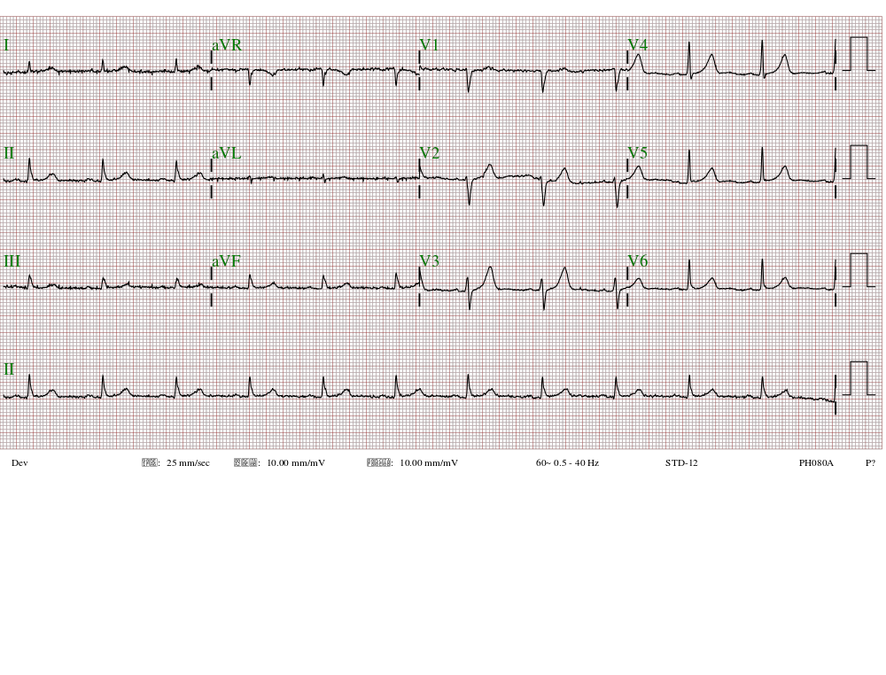

# ECG human-machine competition dataset

This dataset includes data from eight ECG-based human-machine competitions, designed to evaluate the performance of machine learning algorithms in detecting and diagnosing cardiovascular diseases. The dataset contains ECG recordings from multiple subjects, with corresponding annotations indicating the presence or absence of various cardiovascular diseases.

## Competitions

The dataset includes data from the following competitions:

**1. Myocardial infarction**

**2. Arrhythmia**

**3. Pericarditis**

**4. Digoxin toxicity**

**5. Pneumothorax**

**6. Aortic dissection**

**7. Pulmonary embolism**

**8. Dyskalemia**

**Note: The raw data is expected to be published in August 2023**

## Data format

Each dataset is stored as a CSV file, with each row representing a single ECG recording. There are three CSV files **"label.csv"**, **"user_results.csv"**, and **"AI_pred.csv"** describing the groundtruth, human answer, and AI predictions. The columns of the CSV file include:

**hash_id**: The unique identifier for the ECG recording.

### label.csv

**LABEL[...]**: The groundtruth of corresponding ECG using 0 (without) and 1 (with). The labels column contains a list of labels indicating the presence or absence of cardiovascular diseases, as determined by human experts or medical records.

### user_results.csv

**DOCTOR_ID**: The human's specialty and level of experience.

**USER_ANSWER[...]**: The answer given by human corresponding to the ECG recording using 0 (without) and 1 (with).

### AI_pred.csv

**AI[...]**: The predictions given by the baseline models, which was a likelihood ranged 0 to 1.

The signal column contains the raw ECG recording, with each value representing the amplitude of the ECG signal at a given time point. All ECGs are 12-lead and 10 seconds with 500 Hz. Therefore, the length of number sequence is 5,000 for each lead. The unit of value is 0.01 mV, which is the standard Philip record system. 

## Codes

The folder **"code"** contains the code to draw ROC plot for each dataset. Moreover, an ECG is also provided as following.

The ECG also can be presented as a SVG file.

## Related publications for the datasets

Below papers provided the baseline model to predict the likelihood of each label.

| Dataset | Title                                                        | Paper                  | Citation |
| ------- | ------------------------------------------------------------ | ---------------------- | -------- |
| Myocardial infarction | [A deep-learning algorithm for detecting acute myocardial infarction](https://eurointervention.pcronline.com/article/a-deep-learning-algorithm-for-detecting-acute-myocardial-infarction) | EuroIntervention, 17(9):765-773. | 
| Pericarditis | [A Deep Learning Algorithm for Detecting Acute Pericarditis by Electrocardiogram](https://www.mdpi.com/2075-4426/12/7/1150) | J Pers Med, 12(7):1150. | 
| Digoxin toxicity | [Detecting Digoxin Toxicity by Artificial Intelligence-Assisted Electrocardiography.](https://www.mdpi.com/1660-4601/18/7/3839) | Int J Environ Res Public Health, 18(7), 3839. | 
| Pneumothorax | [A deep learning-based system capable of detecting pneumothorax via electrocardiogram](https://link.springer.com/article/10.1007/s00068-022-01904-3) | Eur J Trauma Emerg Surg, 48(4):3317-3326. | 
| Aortic dissection | [A Deep-Learning Algorithm-Enhanced System Integrating Electrocardiograms and Chest X-rays for Diagnosing Aortic Dissection](https://www.sciencedirect.com/science/article/pii/S0828282X21007492) | Can J Cardiol, 38(2):160-168. | 
| Dyskalemia | [A Deep-Learning Algorithm (ECG12Net) for Detecting Hypokalemia and Hyperkalemia by Electrocardiography: Algorithm Development](https://medinform.jmir.org/2020/3/e15931/) | JMIR Med Inform, 8(3):e15931. | 
