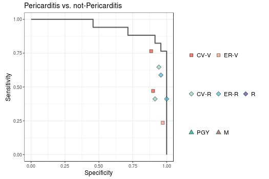

# ECG human-machine competition dataset

This dataset includes data from eight ECG-based human-machine competitions, designed to evaluate the performance of machine learning algorithms in detecting and diagnosing cardiovascular diseases. The dataset contains ECG recordings from multiple subjects, with corresponding annotations indicating the presence or absence of various cardiovascular diseases.

## Data format

Each dataset is stored as a CSV file, with each row representing a single ECG recording. There are three CSV files **"label.csv"**, **"user_results.csv"**, and **"AI_pred.csv"** describing the groundtruth, human answer, and AI predictions. The columns of the CSV file include:

**hash_id**: The unique identifier for the ECG recording.

### label.csv

**LABEL[...]**: The groundtruth of corresponding ECG using 0 (without) and 1 (with). The labels column contains a list of labels indicating the presence or absence of cardiovascular diseases, as determined by human experts or medical records.

### user_results.csv

**DOCTOR_ID**: The human's specialty and level of experience. **CV** means cardiologist; **ER** means emergency physicians; **V[..]** means the year of attending physician;  **R[..]** means the year of resident; **PGY[..]** means the year of post graduate year;  **M[..]** means the grade of medical students.  

**USER_ANSWER[...]**: The answer given by human corresponding to the ECG recording using 0 (without) and 1 (with).

### AI_pred.csv

**AI[...]**: The predictions given by the baseline models, which was a likelihood ranged 0 to 1.

The signal column contains the raw ECG recording, with each value representing the amplitude of the ECG signal at a given time point. All ECGs are 12-lead and 10 seconds with 500 Hz. Therefore, the length of number sequence is 5,000 for each lead. The unit of value is 0.01 mV, which is the standard Philip record system. 

The overall file structure is as follows:

```shell
ECG-human-machine-competition
├── result
│   ├── ...
├── ecg
│   ├── 0a5e481205fb668d8d60f6f99a6500b1.csv
│   ├── ...
│   ├── ffcc3cddec66e58ff7952b254844e2a5.csv
├── data
│   ├── myocardial infarction
│   │   ├── AI_pred.csv
│   │   ├── label.csv
│   │   ├── user_results.csv
│   ├── arrhythmia
│   │   ├── ...
│   ├── pericarditis
│   │   ├── ...
│   ├── digoxin concentration
│   │   ├── ...
│   ├── pneumothorax
│   │   ├── ...
│   ├── aortic dissection
│   │   ├── ...
│   ├── pulmonary embolism
│   │   ├── ...
│   ├── dyskalemia
│   │   ├── ...
├── code
│   ├── 000. show ECG.R
│   ├── 001. myocardial infarction.R
│   ├── ...
│   ├── 008. dyskalemia.R
```

## Competitions

The dataset includes data from the following competitions:

**1. Myocardial infarction**

Acute myocardial infarction (AMI) is a critical medical emergency that requires urgent and specialized attention. It is caused by the sudden blockage of a coronary artery, resulting in the loss of blood supply to the heart muscle. This can lead to severe and potentially irreversible damage to the heart, with serious consequences such as heart failure, arrhythmias, or even death. It is essential to recognize the signs and symptoms of AMI, including chest pain or discomfort, shortness of breath, nausea or vomiting, and lightheadedness or dizziness. Timely diagnosis and appropriate treatment are critical for improving outcomes and reducing the risk of complications. This may include interventions such as percutaneous coronary intervention (PCI), thrombolytic therapy, or coronary artery bypass grafting (CABG), as well as ongoing medical management and lifestyle modifications. Overall, the importance of AMI lies in its potential to cause significant morbidity and mortality, highlighting the need for timely and effective management to optimize patient outcomes.

Electrocardiogram (ECG) is a fundamental tool for the diagnosis of AMI. The ECG allows healthcare professionals to detect and analyze changes in the electrical activity of the heart that occur during an AMI, such as ST-segment elevation or depression, Q waves, or T-wave inversions. These changes can provide valuable information about the location, extent, and severity of the myocardial damage, which can guide treatment decisions and prognosis. ECG is also critical for differentiating AMI from other cardiac and non-cardiac conditions that may mimic its symptoms, such as unstable angina, pericarditis, or pulmonary embolism. Rapid ECG interpretation and reporting are essential for timely diagnosis and initiation of appropriate management, which can significantly improve outcomes and reduce morbidity and mortality. Therefore, the ECG is a vital tool for the diagnosis of AMI and should be performed promptly in all patients presenting with suggestive symptoms.

This dataset contains 175 STEMI ECGs (n. STEMI-LMCA = 2; n. STEMI-LAD = 95; n. STEMI-LCx = 12; n. STEMI-RCA = 66), 137 NSTEMI ECGs, and 138 not-AMI ECGs. All ECGs were obtained from the emergency department, while STEMI and NSTEMI were annotated by follow-up cardiac catheterization results. The baseline model has been published in [EuroIntervention, 17(9):765-773.](https://eurointervention.pcronline.com/article/a-deep-learning-algorithm-for-detecting-acute-myocardial-infarction). Using the sum of four STEMI likelihood (AI[STEMI-LMCA] + AI[STEMI-LAD] + AI[STEMI-LCx] + AI[STEMI-RCA]) to distinguish STEMI (LABEL[STEMI-LMCA] + LABEL[STEMI-LAD] + LABEL[STEMI-LCx] + LABEL[STEMI-RCA]) or not (LABEL[NSTEMI] + LABEL[Normal]), an area under receiver operating characteristic curve (AUC) of 0.9717 will be presented. There are some tricks to improve this AUC, like adding up the likelihood of NSTEMI. Therefore, the AUC here is different with the published paper. However, this simple example still can be used as a reference for future benchmark. The AUC is 0.8586 using the likelihood of NSTEMI (AI[NSTEMI]) to identify NSTEMI (LABEL[NSTEMI]). The ROC curve and human accuracies were shown as follows.


**2. Arrhythmia**

Electrocardiography (ECG) is a crucial tool in the diagnosis of arrhythmias, which are abnormal heart rhythms that can range from benign to life-threatening. ECG can detect a wide range of arrhythmias, including atrial fibrillation, ventricular tachycardia, and bradyarrhythmias. Accurate identification of arrhythmias is essential for guiding appropriate treatment decisions, as some arrhythmias may require immediate intervention to prevent complications such as stroke or cardiac arrest. In addition, ECG monitoring can help assess the effectiveness of antiarrhythmic medications or other interventions, and guide decisions about the need for further testing or referral to a specialist. Therefore, ECG is an essential diagnostic tool in the management of arrhythmias, and should be routinely used in clinical practice to optimize patient outcomes.

While ECG is an important tool in the diagnosis of arrhythmias, it can also present challenges for healthcare professionals. ECG interpretation requires a high level of skill and experience, as some arrhythmias may be subtle or difficult to identify. In addition, certain factors such as patient movement, poor electrode placement, or underlying medical conditions can also impact the accuracy of ECG readings. Furthermore, ECG may not always capture arrhythmias that are intermittent or transient, and additional monitoring may be necessary to detect these conditions. Therefore, healthcare professionals must be vigilant and thorough in their ECG interpretation, and consider a range of factors such as patient history, symptoms, and clinical presentation when making a diagnosis. In cases where arrhythmias are suspected but not confirmed by ECG, further testing or referral to a specialist may be necessary. Ultimately, the accurate diagnosis and management of arrhythmias requires a collaborative and multidisciplinary approach, with healthcare professionals working together to provide comprehensive and effective care to their patients.

This dataset contains 193 ECGs with different combinations of arrhythmia. It must be noted that the options for this task are multiple choice questions and not single choice questions. An ECG may show multiple arrhythmias at the same time. There are 21 arrhythmias in this dataset, including 2:1 AV block (n = 4), Atrial fibrillation (n = 16), Atrial flutter (Typical/atypical) (n = 12), Atrial premature contraction (Bigeminy/Trigeminy/Quadrigeminy) (n = 23), Complete AV block (n = 10), Complete left bundle branch block (n = 11), Complete right bundle branch block (n = 40), First-degree AV block (n = 40), Idiopathic ventricular rhythm (n = 1), Junctional bradycardia/Junctional escape rhythm (n = 11), Multifocal atrial tachycardia (n = 1), Pacemaker rhythm (n = 14), Paroxysmal supraventricular tachycardia (n = 10), Second-degree AV block (Mobitz type I) (n = 6), Sinus arrhythmia (n = 10), Sinus bradycardia (n = 11), Sinus rhythm (n = 36), Sinus tachycardia (n = 20), Ventricular premature contraction (Bigeminy/Trigeminy/Quadrigeminy) (n = 17), Ventricular tachycardia (n = 7), Wolff-Parkinson-White syndrome with pre-excitation (n = 10). The groundtruth is based on consensus of 5 cardiologists. In overall, although this task is difficult since multiple arrhythmia in an ECG, the waveforms of each arrhythmia are typical. Using the likelihood of each arrhythmia, the area under receiver operating characteristic curves (AUCs) are 1.0000 [2:1 AV block], 0.9883 [Atrial fibrillation], 0.9820 [Atrial flutter (Typical/atypical)], 0.9432 [Atrial premature contraction (Bigeminy/Trigeminy/Quadrigeminy)], 0.9869 [Complete AV block], 0.9990 [Complete left bundle branch block], 0.9761 [Complete right bundle branch block], 0.9596 [First-degree AV block], 0.7396 [Idiopathic ventricular rhythm], 0.9990 [Junctional bradycardia/Junctional escape rhythm], 0.5000 [Multifocal atrial tachycardia], 0.9988 [Pacemaker rhythm], 0.9929 [Paroxysmal supraventricular tachycardia], 0.8057 [Second-degree AV block (Mobitz type I)], 0.8060 [Sinus arrhythmia], 0.9910 [Sinus bradycardia], 0.8378 [Sinus rhythm], 0.9890 [Sinus tachycardia], 0.9870 [Ventricular premature contraction (Bigeminy/Trigeminy/Quadrigeminy)], 0.9946 [Ventricular tachycardia], 0.9989 [Wolff-Parkinson-White syndrome with pre-excitation], respectively. It is worth noting that the baseline model performed very poor in idiopathic ventricular rhythm, multifocal atrial tachycardia, second-degree AV block (Mobitz type I). The baseline model is under review currently. The ROC curve and human accuracies were shown as follows.


**3. Pericarditis**

Pericarditis is an inflammation of the pericardium, the thin sac that surrounds the heart. It can be caused by a variety of factors, including viral or bacterial infections, autoimmune disorders, or heart attack. Pericarditis can lead to chest pain, shortness of breath, and fever, and in severe cases, it can cause cardiac tamponade, a life-threatening condition in which the fluid accumulates around the heart and compresses it, leading to decreased cardiac output. Diagnosis of pericarditis requires a combination of clinical assessment, imaging tests such as echocardiography or magnetic resonance imaging (MRI), and laboratory tests such as C-reactive protein (CRP) and erythrocyte sedimentation rate (ESR). Treatment options for pericarditis may include nonsteroidal anti-inflammatory drugs (NSAIDs), colchicine, or corticosteroids. The key to successful management of pericarditis is prompt recognition and treatment to prevent complications and optimize patient outcomes. Therefore, healthcare professionals should maintain a high index of suspicion for pericarditis, particularly in patients with chest pain and fever, and be familiar with the appropriate diagnostic and treatment strategies for this condition.

Electrocardiography (ECG) is a valuable tool in the diagnosis of pericarditis, as it can help identify characteristic ECG changes associated with this condition. In pericarditis, ECG can show diffuse ST-segment elevations, often accompanied by PR-segment depressions, particularly in leads II, III, aVF, and V4-V6. These changes can be helpful in distinguishing pericarditis from other causes of chest pain, such as acute myocardial infarction. In addition, ECG can also provide important information on the presence of pericardial effusion or tamponade, which can be a complication of pericarditis. However, ECG findings alone cannot confirm a diagnosis of pericarditis, and further imaging tests such as echocardiography or MRI may be necessary. Nonetheless, ECG can provide important diagnostic information and help guide treatment decisions in patients with suspected pericarditis. Therefore, healthcare professionals should consider ECG as part of the diagnostic workup for patients presenting with chest pain and fever, particularly in those with risk factors for pericarditis, and be prepared to rapidly initiate appropriate diagnostic and treatment measures to optimize patient outcomes.

This dataset contains 17 pericarditis ECGs (LABEL[Pericarditis]) and 70 not-pericarditis ECGs (LABEL[Normal]). All ECGs were obtained from the emergency department and the annotations were defined by review of medical records. The baseline model has been published in [J Pers Med, 12(7):1150.](https://www.mdpi.com/2075-4426/12/7/1150). Using the likelihood of pericarditis (AI[Pericarditis]), the area under receiver operating characteristic curve (AUC) is 0.9437, which is in full agreement with the previous study. The ROC curve and human accuracies were shown as follows.



**4. Digoxin toxicity**

Digoxin is a medication commonly prescribed to treat heart failure and certain heart rhythm disorders. While it can be an effective treatment, it is important to monitor digoxin levels in the blood to prevent toxicity. Digoxin toxicity can occur when the medication accumulates in the body, leading to a range of symptoms such as nausea, vomiting, confusion, vision changes, and even life-threatening arrhythmias. It is important to recognize and manage digoxin toxicity promptly as it can cause serious harm to the patient. Regular monitoring of digoxin levels and careful dosing can help prevent toxicity and ensure the medication is providing its intended benefits. Thus, healthcare professionals should be vigilant and knowledgeable about the signs and symptoms of digoxin toxicity, as well as appropriate management strategies, in order to provide safe and effective care to their patients.

Electrocardiography (ECG) is a non-invasive test that records the electrical activity of the heart. It is an essential tool for the diagnosis and management of many cardiac conditions, including digoxin toxicity. Digoxin toxicity can cause a variety of ECG changes, including abnormalities in heart rate, rhythm, and conduction. For example, patients with digoxin toxicity may develop a slow heart rate, a prolonged PR interval, or an irregular rhythm such as atrial fibrillation. These ECG changes can help healthcare professionals diagnose and monitor digoxin toxicity, and determine the appropriate treatment. In addition, serial ECG monitoring can be used to assess the effectiveness of treatment and guide decisions about medication dosing. Thus, ECG is an important diagnostic tool for identifying and managing digoxin toxicity, and should be included in the routine monitoring of patients receiving digoxin therapy.

This dataset contains 13 ECGs with digoxin toxicity (LABEL[High risk]) and 52 ECGs without digoxin toxicity (LABEL[Normal]). All ECGs were obtained from the emergency department and the annotations were defined by review of medical records. The baseline model has been published in [Int J Environ Res Public Health, 18(7), 3839.](https://www.mdpi.com/1660-4601/18/7/3839). Using the likelihood of digoxin toxicity (AI[High risk]), the area under receiver operating characteristic curve (AUC) is 0.9290, which is in full agreement with the previous study. The ROC curve and human accuracies were shown as follows.


**5. Pneumothorax**

Pneumothorax is a medical emergency that occurs when air enters the pleural space, the area between the lung and the chest wall. This can cause the affected lung to collapse, leading to breathing difficulties, chest pain, and even death if not promptly recognized and treated. Pneumothorax can be caused by a variety of factors, such as trauma, lung disease, or medical procedures. It is important to be aware of the signs and symptoms of pneumothorax, which can include sudden onset of chest pain, shortness of breath, and decreased oxygen saturation. Healthcare professionals should also be familiar with the diagnostic tests for pneumothorax, such as chest X-rays and computed tomography (CT) scans, and the different treatment options available, such as observation, needle aspiration, or chest tube insertion. Timely recognition and management of pneumothorax can help prevent serious complications and improve patient outcomes. Therefore, healthcare professionals should be vigilant in identifying and managing pneumothorax, particularly in high-risk patients or those undergoing medical procedures that can potentially cause this condition.

While electrocardiography (ECG) is not a diagnostic tool for pneumothorax itself, it is an important test that can help identify potential complications of this condition. When a pneumothorax occurs, it can cause pressure on the heart and blood vessels, leading to changes in the ECG. These changes can include ST-segment elevation, T-wave inversions, and other abnormalities that may mimic the signs of a heart attack. By recognizing these ECG changes, healthcare professionals can more quickly and accurately diagnose pneumothorax and initiate appropriate treatment. In addition, ECG monitoring can help detect any potential cardiac complications that may arise as a result of pneumothorax, such as arrhythmias or cardiac arrest. Therefore, while ECG alone is not a diagnostic tool for pneumothorax, it can play an important role in identifying and managing potential complications of this condition.

This dataset contains 19 ECGs with pneumothorax (LABEL[Left Pneumothorax] + LABEL[Right Pneumothorax]) and 81 ECGs without digoxin toxicity (LABEL[Normal]). All ECGs were obtained from the emergency department and the annotations were defined by review of medical records. The baseline model has been published in [Eur J Trauma Emerg Surg, 48(4):3317-3326.](https://link.springer.com/article/10.1007/s00068-022-01904-3). Using the sum of pneumothorax likelihood (AI[Left Pneumothorax] + AI[Right Pneumothorax]), the area under receiver operating characteristic curve (AUC) is 0.9565, which is in full agreement with the previous study. The ROC curve and human accuracies were shown as follows.


**6. Aortic dissection**

Aortic dissection is a life-threatening condition in which the inner layer of the aorta tears, causing blood to flow between the layers of the aortic wall. This can lead to severe chest pain, difficulty breathing, and potentially fatal complications such as aortic rupture or organ damage. Aortic dissection is a medical emergency that requires prompt diagnosis and treatment. It can occur in people with pre-existing conditions such as hypertension or connective tissue disorders, as well as in otherwise healthy individuals. Healthcare professionals must be vigilant in recognizing the signs and symptoms of aortic dissection, which can include sudden and severe chest or back pain, a difference in blood pressure between the arms, and signs of organ damage such as neurological deficits or acute kidney injury. Aortic dissection can be diagnosed through a variety of tests, including computed tomography (CT) scans, magnetic resonance imaging (MRI), or echocardiography. Early diagnosis and treatment of aortic dissection can greatly improve the chances of survival and prevent serious complications. Therefore, healthcare professionals should maintain a high index of suspicion for aortic dissection, particularly in high-risk patients, and be prepared to rapidly initiate appropriate diagnostic and treatment measures in order to optimize patient outcomes.

Electrocardiography (ECG) is a useful tool in the diagnosis of aortic dissection, as it can help identify associated cardiac complications and rule out other causes of chest pain. In aortic dissection, ECG can show signs of myocardial ischemia or infarction, such as ST-segment elevations or T-wave inversions. These changes can indicate that the aortic dissection has caused a blockage in the coronary arteries or impaired blood flow to the heart. ECG can also identify other potential complications of aortic dissection, such as arrhythmias or pericardial effusion. However, ECG findings alone cannot confirm a diagnosis of aortic dissection, and further imaging tests such as CT scans or MRI are required. Nonetheless, ECG can provide important diagnostic information and help guide treatment decisions in patients with suspected aortic dissection. Therefore, healthcare professionals should consider ECG as part of the diagnostic workup for patients presenting with chest pain, particularly in those with a history of cardiovascular disease or other risk factors for aortic dissection.

This dataset contains 43 ECGs with aortic dissection (LABEL[Aortic Dissection - Type A] + LABEL[Aortic Dissection - Type B]) and 57 ECGs without digoxin toxicity (LABEL[Normal]). All ECGs were obtained from the emergency department and the annotations were defined by review of medical records. The baseline model has been published in [Can J Cardiol, 38(2):160-168.](https://www.sciencedirect.com/science/article/pii/S0828282X21007492). Using the sum of aortic dissection likelihood (AI[Aortic Dissection - Type A] + AI[Aortic Dissection - Type B]), the area under receiver operating characteristic curve (AUC) is 0.9184, which is in full agreement with the previous study. The ROC curve and human accuracies were shown as follows.


**7. Pulmonary embolism**

Pulmonary embolism (PE) is a serious medical condition that occurs when a blood clot travels from the deep veins of the legs or pelvis to the lungs, obstructing blood flow and potentially causing damage to the lung tissue. PE can lead to chest pain, shortness of breath, and even sudden death if not promptly diagnosed and treated. Risk factors for PE include prolonged immobility, surgery, cancer, pregnancy, and certain medical conditions such as deep vein thrombosis (DVT) and atrial fibrillation. Diagnosis of PE requires a high level of suspicion and a combination of clinical assessment, imaging tests such as computed tomography (CT) scans or pulmonary angiography, and laboratory tests such as D-dimer levels. Treatment options for PE may include anticoagulation therapy, thrombolytic therapy, or surgical interventions. The key to successful management of PE is prompt recognition and treatment to prevent complications such as pulmonary hypertension, recurrent embolism, and death. Therefore, healthcare professionals should maintain a high index of suspicion for PE, particularly in patients with risk factors, and be familiar with the appropriate diagnostic and treatment strategies for this condition.

Electrocardiography (ECG) is an important tool in the diagnosis of PE, as it can help identify associated cardiac complications and rule out other causes of chest pain. In PE, ECG can show signs of right ventricular strain or acute cor pulmonale, such as T-wave inversions in leads V1-V4, ST-segment elevations in leads II, III, and aVF, and the presence of a prominent S wave in lead I or aVL. These changes can indicate that the PE has caused increased pressure in the pulmonary artery and right ventricle, leading to right heart strain. ECG can also identify other potential causes of chest pain, such as acute myocardial infarction or pericarditis, which may have similar symptoms to PE. However, ECG findings alone cannot confirm a diagnosis of PE, and further imaging tests such as CT scans or ventilation-perfusion (V/Q) scans are required. Nonetheless, ECG can provide important diagnostic information and help guide treatment decisions in patients with suspected PE. Therefore, healthcare professionals should consider ECG as part of the diagnostic workup for patients presenting with chest pain and dyspnea, particularly in those with risk factors for PE, and be prepared to rapidly initiate appropriate diagnostic and treatment measures to optimize patient outcomes.

This dataset contains 24 ECGs with pulmonary embolism (LABEL[Acute Pulmonary Embolism]) and 76 ECGs without pulmonary embolism  (LABEL[Normal]). All ECGs were obtained from the emergency department and the annotations were defined by manual medical records review. The baseline model will be published in Acta cardiologica sinica soon (accepted). Using the likelihood of pulmonary embolism (AI[Acute Pulmonary Embolism]), the area under receiver operating characteristic curve (AUC) is 0.7654, which is in full agreement with the previous study. The ROC curve and human accuracies were shown as follows.


**8. Dyskalemia**

Dyskalemia, an abnormal serum potassium level, is an essential electrolyte disturbance that can lead to severe and life-threatening consequences if left untreated. Potassium plays a vital role in various physiological processes, including cardiac and neuromuscular function, acid-base balance, and renal function. Therefore, dyskalemia can affect multiple organ systems and cause a range of clinical manifestations, such as cardiac arrhythmias, muscle weakness, renal impairment, and gastrointestinal disturbances. Dyskalemia can result from various factors, such as medications, renal impairment, endocrine disorders, or acid-base disturbances. Monitoring and managing serum potassium levels are crucial to preventing and treating dyskalemia, depending on the underlying cause and severity of the disturbance. Treatment options may include dietary modifications, medication adjustments, intravenous or oral potassium supplementation, or other interventions such as renal replacement therapy or dialysis. The importance of dyskalemia lies in its potential to cause significant morbidity and mortality, highlighting the need for early recognition, prompt management, and close monitoring to optimize patient outcomes.

Electrocardiogram (ECG) is a valuable tool for diagnosing and monitoring dyskalemia, an abnormal serum potassium level. Potassium is essential for the proper functioning of cardiac myocytes, and even minor fluctuations in serum potassium levels can lead to significant changes in cardiac electrical activity. As such, dyskalemia can cause various ECG abnormalities, including peaked T waves, prolonged QT interval, ST segment changes, and even ventricular arrhythmias. These ECG changes can provide important clues to the diagnosis of dyskalemia and guide the management of the condition. ECG monitoring is especially important in patients at risk of dyskalemia, such as those with renal insufficiency, endocrine disorders, or taking medications that can affect potassium homeostasis. Timely recognition of dyskalemia through ECG can allow for early intervention to prevent potentially life-threatening complications such as cardiac arrhythmias or sudden cardiac death. Therefore, ECG is a crucial tool for the diagnosis and management of dyskalemia, and healthcare professionals should be vigilant in monitoring ECG changes in patients at risk of this electrolyte disturbance.

This dataset contains 60 severe hypokalemia (LABEL[K: <= 2.5]), 60 mild-to-moderate hypokalemia (LABEL[K: 2.5 ~ 3.5]), 60 normokalemia (LABEL[K: 3.5 ~ 5.5]), 60 mild-to-moderate hyperkalemia (LABEL[K: 5.5 ~ 6.5]), and 60 severe hyperkalemia (LABEL[K: >= 6.5]). All ECGs were obtained from the emergency department and the potassium level were annotated by the central laboratory reports within 1 hour. This competition was first appeared in [JMIR Med Inform, 8(3):e15931.](https://medinform.jmir.org/2020/3/e15931/), however, the model here is an unpublished improved version. The area under receiver operating characteristic curves (AUCs) for detecting severe hypokalemia, mild-to-severe hypokalemia, mild-to-severe hyperkalemia, and severe hypokalemia were 0.9561, 0.9226, 0.9128, and 0.8342, respectively. They are different with previous publication since the details of analysis is different. For example, the paper mentioned above using LABEL[K: >= 6.5] vs. LABEL[K: <= 2.5]+LABEL[K: 2.5 ~ 3.5]+LABEL[K: 3.5 ~ 5.5] to achieve an AUC of 0.976, but here we use LABEL[K: >= 6.5]+LABEL[K: 5.5 ~ 6.5] vs. LABEL[K: <= 2.5]+LABEL[K: 2.5 ~ 3.5]+LABEL[K: 3.5 ~ 5.5] to achieve an AUC of 0.8342. Compared to the previous prospective validation pubished in [npj Digital Medicine, 5(1):8.](https://www.nature.com/articles/s41746-021-00550-0), the lower accuracy of this data set is due to the different distribution of potassium ion concentration. Normally, more than 80% of the cases should have a potassium ion concentration between 3.5 and 5.5, and it is easy for the model to identify them. The ROC curve of this benchmark were shown as follows.


## Codes

The folder **"code"** contains the code to draw ROC plot for each dataset. Moreover, an ECG is also provided as following using a SVG format.


## Related publications for the datasets

Below papers provided the baseline model to predict the likelihood of each label.

| Dataset | Title                                                        | Paper                  | Citation |
| ------- | ------------------------------------------------------------ | ---------------------- | -------- |
| Myocardial infarction | [A deep-learning algorithm for detecting acute myocardial infarction](https://eurointervention.pcronline.com/article/a-deep-learning-algorithm-for-detecting-acute-myocardial-infarction) | EuroIntervention, 17(9):765-773. | [](https://www.semanticscholar.org/paper/A-Gentle-Introduction-to-Graph-Neural-Networks-S%C3%A1nchez-Lengeling-Reif/1ce16e3039606943d287da23c8510b2d3e66ed28)
| Arrhythmia | [Development of an Artificial Intelligence-Enabled Electrocardiography to Detect 23 Cardiac Arrhythmias and Predict Cardiovascular Outcomes]([https://www.mdpi.com/2075-4426/12/7/1150](https://link.springer.com/article/10.1007/s10916-025-02177-0)) | J Med Syst, 49(1):51. | [](https://www.semanticscholar.org/paper/Development-of-an-Artificial-Intelligence-Enabled-Lin-Lin/5517ed4c3eb27efaa6b1b8643c5e1d94da39f3c6)
| Pericarditis | [A Deep Learning Algorithm for Detecting Acute Pericarditis by Electrocardiogram](https://www.mdpi.com/2075-4426/12/7/1150) | J Pers Med, 12(7):1150. | [](https://www.semanticscholar.org/paper/A-Gentle-Introduction-to-Graph-Neural-Networks-S%C3%A1nchez-Lengeling-Reif/2270bf57bd38d133486f5d24e387179ce15b1d4e)
| Digoxin toxicity | [Detecting Digoxin Toxicity by Artificial Intelligence-Assisted Electrocardiography.](https://www.mdpi.com/1660-4601/18/7/3839) | Int J Environ Res Public Health, 18(7), 3839. | [](https://www.semanticscholar.org/paper/A-Gentle-Introduction-to-Graph-Neural-Networks-S%C3%A1nchez-Lengeling-Reif/c45eeabc541e4068ab93f293e40ea711da2899ab)
| Pneumothorax | [A deep learning-based system capable of detecting pneumothorax via electrocardiogram](https://link.springer.com/article/10.1007/s00068-022-01904-3) | Eur J Trauma Emerg Surg, 48(4):3317-3326. | [](https://www.semanticscholar.org/paper/A-Gentle-Introduction-to-Graph-Neural-Networks-S%C3%A1nchez-Lengeling-Reif/faf727f89c1ce8ee8bf88c351044c11ed7143927)
| Aortic dissection | [A Deep-Learning Algorithm-Enhanced System Integrating Electrocardiograms and Chest X-rays for Diagnosing Aortic Dissection](https://www.sciencedirect.com/science/article/pii/S0828282X21007492) | Can J Cardiol, 38(2):160-168. | [](https://www.semanticscholar.org/paper/A-Gentle-Introduction-to-Graph-Neural-Networks-S%C3%A1nchez-Lengeling-Reif/a63e02c581425a038d410a32e0c3a747bf4754c6)
| Pulmonary embolism | [A Deep-Learning Algorithm-Enhanced Electrocardiogram Interpretation for Detecting Pulmonary Embolism](https://www.tsoc.org.tw/upload/journal/1/20231130/acs-39-913.pdf) | Acta Cardiol Sin, 39(6):913–928. | [](https://www.semanticscholar.org/paper/A-Deep-Learning-Algorithm-Enhanced-Interpretation-Chen-Tsai/b227555652687d349b8ad329bd4953b43a1f30c0)
| Dyskalemia | [A Deep-Learning Algorithm (ECG12Net) for Detecting Hypokalemia and Hyperkalemia by Electrocardiography: Algorithm Development](https://medinform.jmir.org/2020/3/e15931/) | JMIR Med Inform, 8(3):e15931. | [](https://www.semanticscholar.org/paper/A-Gentle-Introduction-to-Graph-Neural-Networks-S%C3%A1nchez-Lengeling-Reif/8296e995198e06a8026ce6a45b9bdeebdd1b099a)
